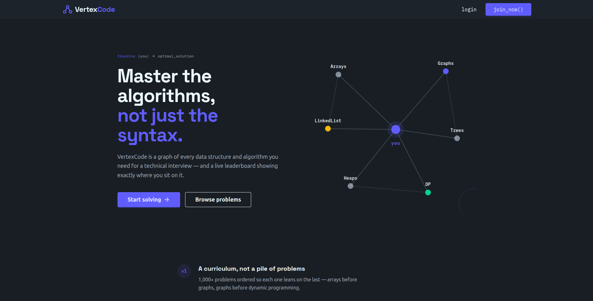

# VertexCode


VertexCode is a competitive coding platform where users can practice problems, run and submit solutions, track their progress, compete on a global leaderboard, and unlock Pro reference solutions via Stripe subscriptions.



## Tech Stack

- **Frontend**
  - React 19 + Vite 7
  - React Router 7
  - Redux Toolkit + Redux Persist
  - TanStack Query (React Query)
  - Tailwind CSS 4 + DaisyUI 5
  - Monaco Editor (`@monaco-editor/react`)
  - React Hook Form + Zod
  - Axios, Lucide React, Stripe.js

- **Backend**
  - Express.js 5
  - MongoDB + Mongoose
  - Redis (OTP / password reset caching)
  - Supabase (avatar storage)
  - Nodemailer (email verification & password reset)
  - Stripe (subscriptions)
  - Judge0 via RapidAPI (code execution)

## Features

- User authentication with signup, login, OTP email verification, and forgot password
- JWT-based protected routes with auto token refresh
- Profile management with avatar upload and bio
- Coding problem list with difficulty filtering, search, and pagination
- Integrated Monaco code editor with multi-language support
- Run and submit solutions with test case results
- Submission history and "recently solved" tracking
- Global leaderboard with podium cards and avatars
- Pro subscription tiers (monthly / yearly) via Stripe Checkout
- Pro members can unlock reference solutions and editorial content
- Admin dashboard for creating, updating, and deleting problems
- Responsive UI with a custom landing page

## Folder Structure

```
VertexCode/
├── Frontend/                  # React Vite frontend
│   ├── public/
│   │   ├── assets/            # Screenshot assets and images
│   │   └── logo.png
│   ├── src/
│   │   ├── components/        # Reusable UI components (Navbar, Editor, Admin panels)
│   │   ├── pages/             # Route-level page components
│   │   ├── store/             # Redux store configuration
│   │   ├── utils/             # Axios client and API base helpers
│   │   ├── App.jsx            # App routes and auth guards
│   │   ├── authSlice.js       # Redux auth slice and thunks
│   │   ├── main.jsx           # React entry point
│   │   └── index.css          # Tailwind entry styles
│   ├── .env                   # Frontend environment variables
│   ├── package.json
│   └── vite.config.js
├── Backend/                   # Express API server
│   ├── src/
│   │   ├── config/            # DB, Redis, Supabase, Multer configs
│   │   ├── controllers/       # Route controllers
│   │   ├── middleware/        # Auth, admin, subscription middleware
│   │   ├── models/            # Mongoose schemas
│   │   ├── routes/            # API route definitions
│   │   ├── services/          # Email service
│   │   ├── utils/             # Email templates, validators, Judge0 helpers
│   │   ├── server.js          # Server entry point
│   │   └── index.js           # Express app setup
│   ├── .env                   # Backend environment variables
│   └── package.json
└── README.md                  # This file
```

## Prerequisites

- [Node.js](https://nodejs.org/) 18.x or higher (recommended 20 LTS)
- npm 9+ or higher (npm is used by the lockfiles present)
- MongoDB Atlas cluster or local MongoDB instance
- Redis instance (for OTP/password reset caching)
- Supabase project (for avatar storage)
- Stripe account (for subscriptions)
- Gmail account with App Password (for email sending)
- Judge0 API key(s) from RapidAPI (for code execution)

## Installation & Setup (Local Desktop)

### 1. Clone the repository

```bash
git clone <repo-url>
cd VertexCode
```

### 2. Install dependencies

```bash
# Backend
cd Backend
npm install

# Frontend
cd ../Frontend
npm install
```

### 3. Set up environment variables

Create `.env` files in both `Backend/` and `Frontend/` using the variables below.

#### Backend `.env`

```env
PORT=3000

# MongoDB
DB_CONNECT_STRING='mongodb+srv://<user>:<pass>@<cluster>.mongodb.net/<dbname>'

# JWT
JWT_KEY='<your-jwt-secret-key>'

# Redis
REDIS_PASS='<your-redis-password>'
REDIS_HOST_ID='<your-redis-host>'
REDIS_PORT=19809

# Judge0 / RapidAPI
X_RAPID_API_KEY_1='<your-rapidapi-key>'
X_RAPID_HOST_KEY_1='judge0-ce.p.rapidapi.com'

# Gmail SMTP
GMAIL_USER='<your-gmail-address>'
GMAIL_APP_PASS='<your-gmail-app-password>'

# Frontend URL
FRONTEND_URL=http://localhost:5173

# Supabase
SUPABASE_URL=https://<your-project>.supabase.co
SUPABASE_SERVICE_ROLE_KEY=<your-service-role-key>

# Stripe
STRIPE_SECRET_KEY=sk_test_<your-stripe-secret-key>
STRIPE_WEBHOOK_SECRET=whsec_<your-webhook-secret>
STRIPE_SUBSCRIPTION_PRODUCT_ID=<your-stripe-product-id>
```

#### Frontend `.env`

```env
VITE_BACKEND_URL=http://localhost:3000
PUBLISH_KEY=pk_test_<your-stripe-publishable-key>
```

### 4. Run the backend development server

```bash
cd Backend
npm run dev
```

The API will run at `http://localhost:3000`.

### 5. Run the frontend development server

Open a new terminal:

```bash
cd Frontend
npm run dev
```

The app will open at `http://localhost:5173`.

## Build for Production

### Frontend

```bash
cd Frontend
npm run build
npm run preview
```

### Backend

```bash
cd Backend
npm start
```

## Available Scripts

### Frontend

| Script       | Description                              |
|--------------|------------------------------------------|
| `npm run dev`     | Start the Vite development server        |
| `npm run build`   | Build the app for production             |
| `npm run lint`    | Run ESLint over the source               |
| `npm run preview` | Preview the production build locally     |

### Backend

| Script      | Description                              |
|-------------|------------------------------------------|
| `npm start` | Run the server in production mode        |
| `npm run dev`    | Run the server with nodemon (auto-reload) |
| `npm test`       | Placeholder test script (no tests yet)     |

## Environment Variables

| Variable | Location | Purpose |
|----------|----------|---------|
| `PORT` | Backend | Port the Express server listens on |
| `DB_CONNECT_STRING` | Backend | MongoDB connection URI |
| `JWT_KEY` | Backend | Secret key for signing JWT tokens |
| `REDIS_PASS` / `REDIS_HOST_ID` / `REDIS_PORT` | Backend | Redis connection credentials for OTP storage |
| `X_RAPID_API_KEY_*` / `X_RAPID_HOST_KEY_*` | Backend | RapidAPI keys for Judge0 code execution |
| `GMAIL_USER` / `GMAIL_APP_PASS` | Backend | SMTP credentials for sending verification / reset emails |
| `FRONTEND_URL` | Backend | CORS / redirect origin for the frontend |
| `SUPABASE_URL` / `SUPABASE_SERVICE_ROLE_KEY` | Backend | Supabase project for avatar storage |
| `STRIPE_SECRET_KEY` / `STRIPE_WEBHOOK_SECRET` / `STRIPE_SUBSCRIPTION_PRODUCT_ID` | Backend | Stripe payment and subscription config |
| `VITE_BACKEND_URL` | Frontend | Base URL for backend API requests |
| `PUBLISH_KEY` | Frontend | Stripe publishable key for client-side checkout |

## Folder/Component Overview

- **Navbar** — responsive navigation with auth state, pro badges, and logout
- **ProblemPage** — split-pane editor + problem description, run/submit flow
- **SubmissionHistory** — previous submissions for a problem
- **Editorial** — reference solution viewer (Pro subscription)
- **AdminPanel / AdminUpdate / AdminDelete** — admin tools for problem management
- **authSlice.js** — Redux logic for login, OTP, password reset, and auth state
- **axiosClient.js** — configured Axios instance with JWT interceptors
- **apiBase.js** — base URL and helper constants

## Contributing

1. Fork the repository
2. Create a feature branch: `git checkout -b feature/my-feature`
3. Commit your changes with clear messages
4. Push to the branch: `git push origin feature/my-feature`
5. Open a pull request

## License

This project is licensed under the ISC License. See the `Backend/package.json` license field for details, or add a `LICENSE` file to the repository root for clarity.
